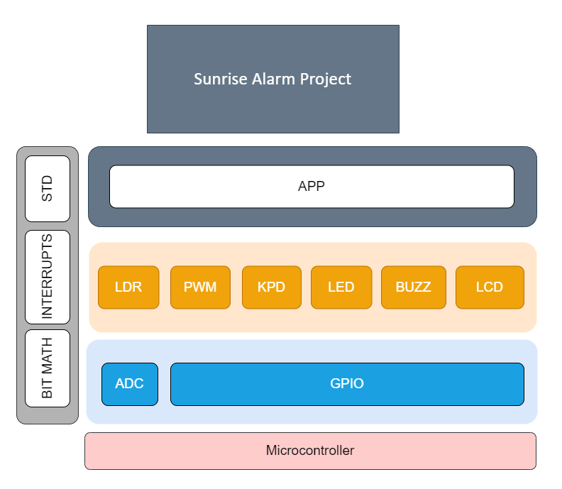

# EME - Egypt Makes Electronics

## Team GUCALEX - CLASS 3 - SEITECH

### Team Members

- Hossam Elwahsh -  
- Mahmoud Abdrabo - 
- Ahmed Sakr - 
- MennaTullah Ahmed - 

### AVR Interfacing Project

#### AVR-Based Sun Rise Alarm

#### Project Description

> The Sun Rise Alarm project is a versatile and customizable alarm system designed to gently wake up by simulating a natural sunrise.

> The Sun Rise Alarm project consists of a user-friendly LCD interface and offers the main features:

#### 1. Set Alarm

- Use the keypad to select an alarm (0-9) where you can set up to 10 alarms.
- After choosing the alarm number, set the alarm time using a four-digit format, e.g., 12:45. This time will be displayed as 12:45 on the LCD Screen.
- As you input the time, the system updates the display in real-time, allowing precise alarm time configuration.
- Once the alarm is set, it will activate automatically when the specified time is reached, gradually illuminating the room.

#### 2. Cancel Alarm

- Select this option to cancel a previously set alarm. Choose the alarm slot you wish to cancel, and the system will cancel it for you, ready for reconfiguration.

#### 3. Show Alarm

- View the details of a specific alarm by selecting its slot. The system will display the time at which the selected alarm is set to activate.

### Alarm Activation 

When an alarm time is reached, the Sunrise Alarm provides a gentle and effective wakeup experience:

- Four LEDs will be dimming for some seconds, simulating a natural sunrise.
- After a while, a buzzer will be activated to ensure the user wakes up.
- The alarm can be dismissed by covering the light sensor (LDR), encouraging the user to get out of bed and start their day.
- Alternatively, alarm can be snoozed by pressing key `C` or `D` on the keypad.
   
  _Snooze durations for the 2 modes can be configured by updating `app_config.h` file_
- If a subsequent alarm is set to activate shortly after the first one, the system will automatically run the next alarm after dismissing the current one.

### Video showcase on 
if link doesn't work copy and paste the following `https://youtu.be/FdnBLit7vIg`
### Layered Architecture

