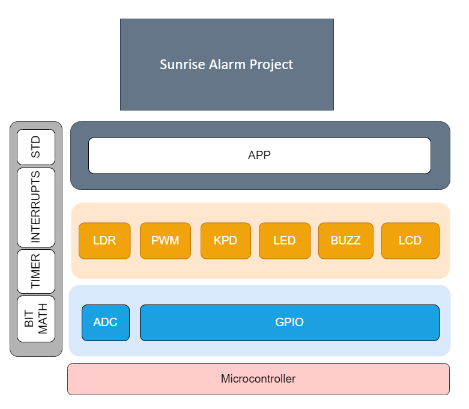

# EME - Egypt Makes Electronics

## Team GUCALEX - CLASS 3 - SEITECH

### Team Members

- Mahmoud Abdrabo - [Github](https://github.com/Mahmoud-Abdrabo)
- Hossam Elwahsh - [Github](https://github.com/HossamElwahsh)
- Ahmed Sakr - [Github](https://github.com/Ahmeddsakrrr)
- MennaTullah Ahmed - [Github](https://github.com/Menna-Ahmed)

### AVR Interfacing Project

#### AVR-Based Sun Rise Alarm

#### Project Description

> The Sun Rise Alarm project is a versatile and customizable alarm system designed to gently wake up by simulating a natural sunrise.

> The Sun Rise Alarm project consists of a user-friendly LCD interface and offers the main features:

#### 1. Set Alarm

- Use the keypad to select an alarm (0-9) where you can set up to 10 alarms.
- After choosing the alarm number, set the alarm time using a four-digit format, e.g., 12:45. This time will be displayed as 12:45 on the LCD Screen.
- As you input the time, the system updates the display in real-time, allowing precise alarm time configuration.
- Once the alarm is set, it will activate automatically when the specified time is reached, gradually illuminating the room.

#### 2. Cancel Alarm

- Select this option to cancel a previously set alarm. Choose the alarm slot you wish to cancel, and the system will reset it to zero, ready for reconfiguration.

#### 3. Show Alarm

- View the details of a specific alarm by selecting its slot. The system will display the time at which the selected alarm is set to activate.

### Alarm Activation 

When an alarm time is reached, the Sunrise Alarm provides a gentle and effective wakeup experience:

- Four LEDs will be dlimming for some seconds, simulating a natural sunrise.
- After the LED simulation, a buzzer activates to ensure the user is awake.
- The buzzer can be silenced by covering the light sensor (LDR), encouraging the user to get out of bed and start their day.
- If a subsequent alarm is set to activate shortly after the first one, the system automatically switches from one alarm to the next, ensuring a seamless wake-up experience.

### Video showcase 👉 [video](Docs/WhatsApp%20Video%202023-09-03%20at%2009.24.20.mp4)

### Layered Architecture

